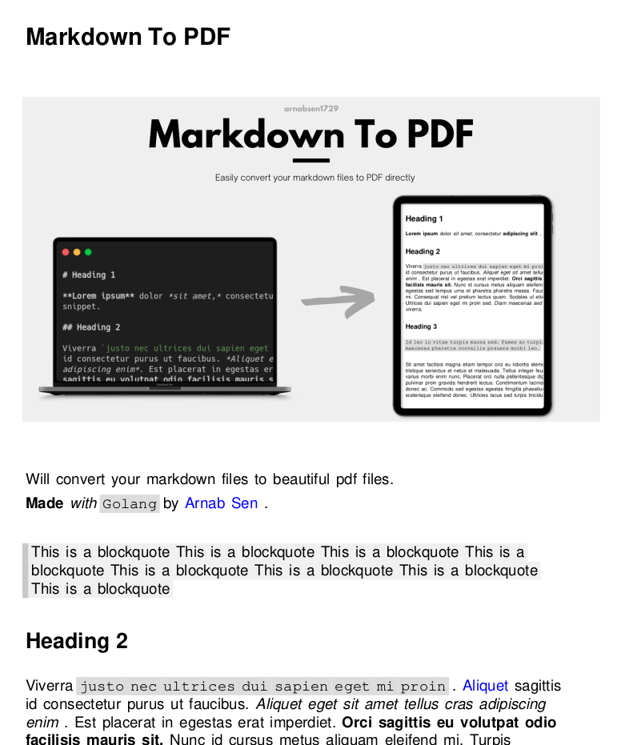
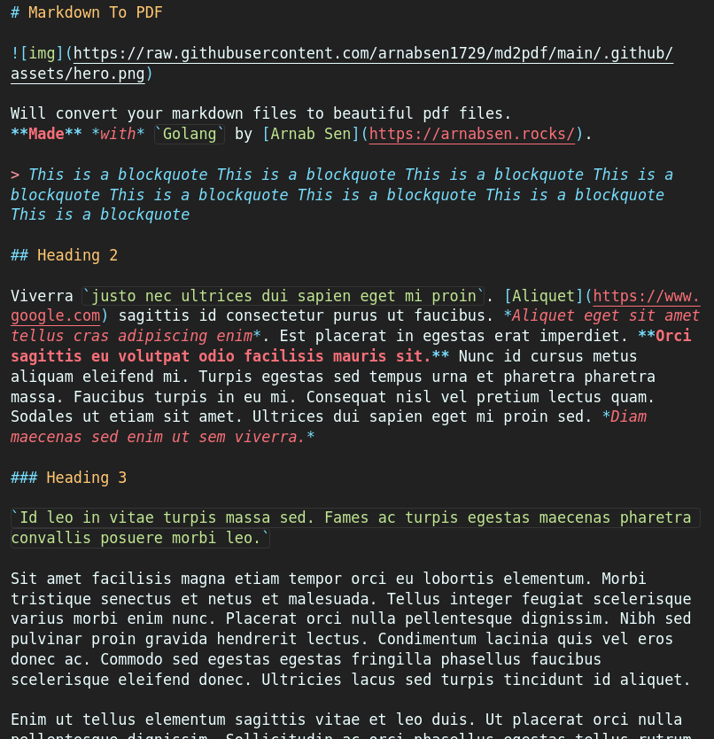

[![Contributors][contributors-shield]][contributors-url]
[![Stargazers][stars-shield]][stars-url]
[![Issues][issues-shield]][issues-url]
[![Builds][builds-shield]][builds-url]
[![Tests][tests-shield]][tests-url]
[![LinkedIn][linkedin-shield]][linkedin-url]
<!-- [![MIT License][license-shield]][license-url] -->
<!-- [![Forks][forks-shield]][forks-url] -->

<!-- PROJECT LOGO -->
<br />
<div align="center">
  <a href="https://github.com/arnabsen1729/md2pdf">
    
  </a>

<h3 align="center">Markdown to PDF</h3>

  <p align="center">
    Will take a markdown file as input and then create a PDF file with the markdown formatting.
    <br />
    <a href="https://github.com/arnabsen1729/md2pdf"><strong>Explore the docs »</strong></a>
    <br />
    <br />
    <a href="https://github.com/arnabsen1729/md2pdf#demo">View Demo</a>
    ·
    <a href="https://github.com/arnabsen1729/md2pdf/issues">Report Bug</a>
    ·
    <a href="https://github.com/arnabsen1729/md2pdf/issues">Request Feature</a>
  </p>
</div>

<!-- ABOUT THE PROJECT -->
## About The Project


Many people love using markdown to take notes and write documentation. But when it comes to sharing it, they need to convert it to PDF. `md2pdf` is a simple tool which does exactly that.

Currently, it supports:
- [X] Headings (L1 - L6)
- [X] Paragraph
- [X] Blockquotes
- [X] Bold
- [X] Italic
- [X] Code
- [X] Link
- [X] Images
- [ ] CodeBlock
- [ ] Lists (Ordered and Unordered)
- [ ] Horizontal Rules
- [ ] Tables


Take a look at the PDF generated from the sample markdown file.
| [PDF File](./test.pdf) | [Markdown File](./test.md) |
|---|---|
|  |  |

<!-- USAGE -->
## Usage

```
$ md2pdf -h
Usage of md2pdf:
  -file string
    	Name of the markdown file to read
  -output string
    	Name of the PDF file to be exported  (default: <input-file-name>.pdf)
```

Example:

```
$ md2pdf -file=MyFile.md -output=MyFile.pdf
```


> This project follows the standard [markdown guidelines](https://www.markdownguide.org/basic-syntax/).

<hr>

[](https://forthebadge.com)
[](https://forthebadge.com)

<!-- MARKDOWN LINKS & IMAGES -->
<!-- https://www.markdownguide.org/basic-syntax/#reference-style-links -->
[contributors-shield]: https://img.shields.io/github/contributors/arnabsen1729/md2pdf.svg?style=for-the-badge
[contributors-url]: https://github.com/arnabsen1729/md2pdf/graphs/contributors
[forks-shield]: https://img.shields.io/github/forks/arnabsen1729/md2pdf.svg?style=for-the-badge
[forks-url]: https://github.com/arnabsen1729/md2pdf/network/members
[stars-shield]: https://img.shields.io/github/stars/arnabsen1729/md2pdf.svg?style=for-the-badge
[stars-url]: https://github.com/arnabsen1729/md2pdf/stargazers
[issues-shield]: https://img.shields.io/github/issues/arnabsen1729/md2pdf.svg?style=for-the-badge
[issues-url]: https://github.com/arnabsen1729/md2pdf/issues
[license-shield]: https://img.shields.io/github/license/arnabsen1729/md2pdf.svg?style=for-the-badge
[license-url]: https://github.com/arnabsen1729/md2pdf/blob/master/LICENSE
[linkedin-shield]: https://img.shields.io/badge/-LinkedIn-black.svg?style=for-the-badge&logo=linkedin&colorB=555
[linkedin-url]: https://linkedin.com/in/arnabsen1729
[builds-shield]: https://img.shields.io/github/workflow/status/arnabsen1729/md2pdf/golangci-lint?style=for-the-badge
[builds-url]: https://github.com/arnabsen1729/md2pdf/actions/workflows/golangci-lint.yml
[tests-shield]: https://img.shields.io/github/workflow/status/arnabsen1729/md2pdf/Test?label=Tests&style=for-the-badge
[tests-url]: https://github.com/arnabsen1729/md2pdf/actions/workflows/test.yml
